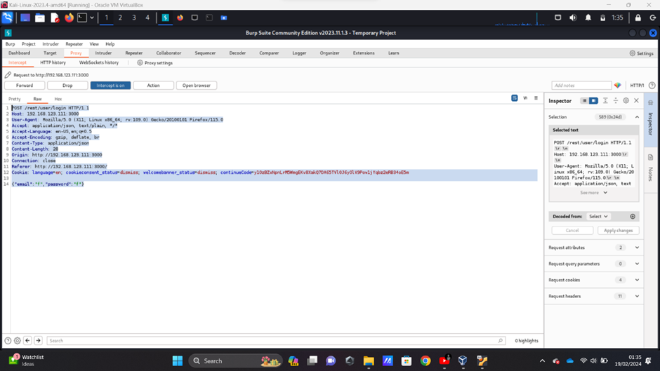

Security testing

Requirement 1

Requirement 2 
Features and Functions
•	User Authentication: Includes registration, login, and password reset functions.
•	Product Management: Display, search, and review of products.
•	Shopping Cart: Adding, modifying, and removing products from the cart.
•	Checkout Process: Simulating the purchase, including payment and shipping options.
•	User Profile Management: Updating user information and preferences.
•	Challenge Tracking: A scoreboard that tracks the completion of various security challenges.
•	Admin Functions: Administrative capabilities for managing the application, users, products, and configurations.

Inputs and Outputs
•	Inputs: User data (e.g., login credentials), product search queries, product reviews, user profile updates, and administrative commands.
•	Outputs: Product listings, search results, authentication status (success/failure messages), user feedback acknowledgments, and challenge completion status.

Expected and Unexpected Behaviours
•	Expected Behaviours: Successful login, product search and display, cart updates, order completions, profile updates, and administrative modifications.
•	Unexpected Behaviours: Application crashes, unauthorized access to sensitive data, leakage of user information, and successful exploitation of vulnerabilities (e.g., SQL injection, XSS).

Requirement 3
 
From here we can access data and change it like I have done here I have give admin access to customer.

Requirements 4  

With this I have inserted “ ‘ or 1=1—“  instead of user name its confuse dataset that user name is correct and give access to admin account.

Requirement 5
 
As you can see here is a normal admin account which I access from change in url
 
This is the original id and role

And in this I change username and change role as well. I tried to log in with second user name and it worked and there is admin account as well.

Requierment 6

in this by add administration in url I bypass 

Requierment 7

 Improper Input Validation we can't give less than 1 in review but we can use inspect to give improper value
  
 as you can see here is 0 star ratting

Requierment 8

with metrics i have accses to many sensitive information 
